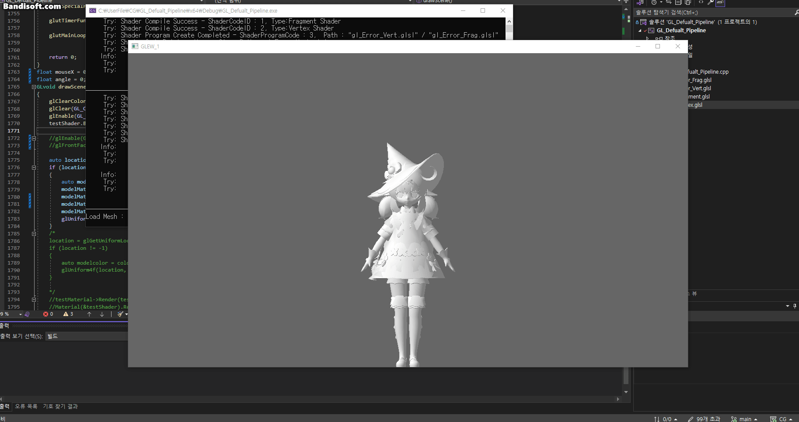

# OpenGL Rendering Pipeline

* * *
# DevLog

## <center> DevLog_1</center>
### <center> - None - </center>
## <center> DevLog_2</center>

### <center> - Assimp inatall & Develop FBX Loader - </center>

<div style="text-align: center;"> (Example : Gensine Impect - Klee) </div>

```c++
class MeshVertex
{
public:
    glm::vec3 pos = glm::vec3(1,1,1);
    glm::vec3 normal = glm::vec3(1, 1, 1);
    glm::vec3 color = glm::vec3(1, 1, 1);
    glm::vec3 tangent = glm::vec3(1, 1, 1);
    glm::vec2 uv0 = glm::vec2(1, 1);
    glm::vec2 uv1 = glm::vec2(1, 1);
    glm::vec2 uv2 = glm::vec2(1, 1);
    glm::vec2 uv3 = glm::vec2(1, 1);
};
```