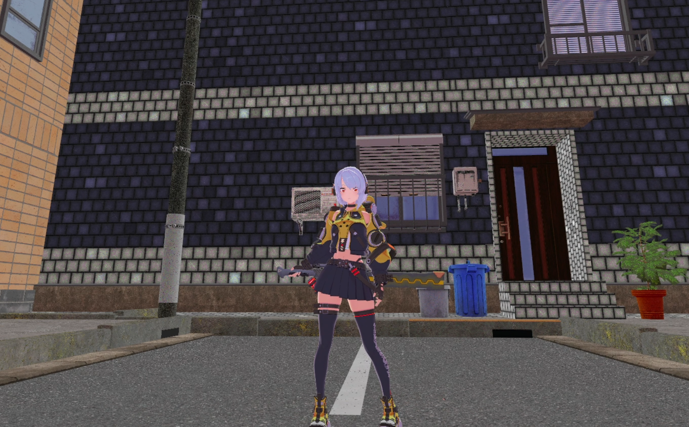
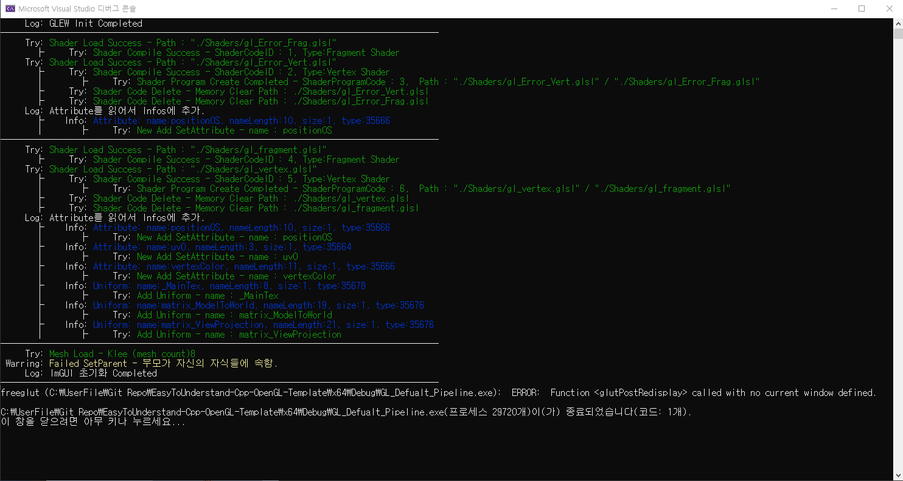
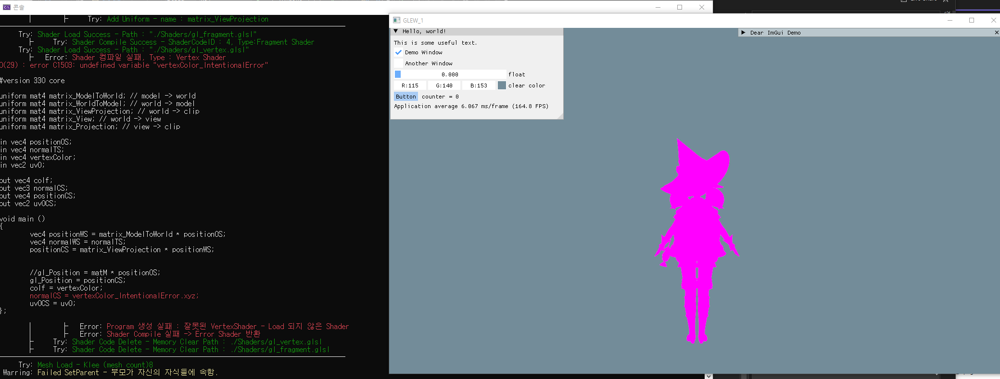

# Cpp OpenGL Rendering Pipeline

### 3rd Party
 - **GLEW, Free GLUT, GLM**
 - **Assimp**
 - **ImGui**
 - **Simple OpenGL Image Library (SOIL)**  
  
[](https://youtu.be/VYsvPh9Y_6E)  
https://youtu.be/VYsvPh9Y_6E  

  
  
  

2023 University (한국공학대학교 2학년 2학기) Graphic OpenGL Rendering Pipeline Process Develop Project
* * *
# DevLog

## <div align="center"> DevLog_7
#### - Toon Shader & AO LightMap
<details>
    <summary>자세히</summary>

#### 간단한 Toon Shader  

  

  

#### AO LightMap

  
**비교 사진**  
  

</details>

## <div align="center"> DevLog_6
#### - Tangent Space & Normal Maping
#### - Face SDF Shadow & CubeMap
<details>
    <summary>자세히</summary>


</details>

## <div align="center"> DevLog_5
#### - Bone Node 기반 Skeleton Animation
<details>
    <summary>자세히</summary>


</details>

## <div align="center"> DevLog_4
#### - SOIL(Image Loader) inatall inatall & Texture Mapping
#### - Error 분석기 & 중단되지 않는 렌더링 -
<details>
    <summary>자세히</summary>




**쉐이더 및 코드상 오류 보고(Log System) & 쉐이더 오류시 중단되지 않고 Error Shader로 표현**

</details>

## <div align="center"> DevLog_3 
#### - IMGUI inatall & Game Logic & Frame System -

<details>
    <summary>자세히</summary>


</br></br>
#### 프로젝트에 추가한 모습
Added to the project.  


</br></br>

#### 로직 시스템 계층 구조

</br></br>

#### 라이프사이클
```c++
void World::WorldUpdate()
{
    for (int i = 0; i < gameObjectList.size(); i++)
        gameObjectList[i]->Enable();
    for (int i = 0; i < gameObjectList.size(); i++)
        gameObjectList[i]->Start();
    for (int i = 0; i < gameObjectList.size(); i++)
        gameObjectList[i]->Update();
    for (int i = 0; i < gameObjectList.size(); i++)
        gameObjectList[i]->LateUpdate();
    for (int i = 0; i < gameObjectList.size(); i++)
        gameObjectList[i]->Disable();
    for (int i = 0; i < gameObjectList.size(); i++)
        gameObjectList[i]->PostBehavior();
    for (int i = 0; i < gameObjectList.size(); i++)
        if (gameObjectList[i]->destroy)
            gameObjectList.erase(gameObjectList.begin() + (i--));
}
void World::WorldRender()
{
    for (int i = 0; i < gameObjectList.size(); i++)
        gameObjectList[i]->BeforeRender();
}
```
</br></br>

</details>

## <div align="center"> DevLog_2 
#### - Assimp inatall & Develop FBX Loader -

<details>
    <summary>자세히</summary>


<div align="center"> (Example : Gensine Impect - Klee) </div>

</details>

## <div align="center"> DevLog_1</div>
#### - Buffer Converter 제작 -
<details>
    <summary>자세히</summary>


</details>