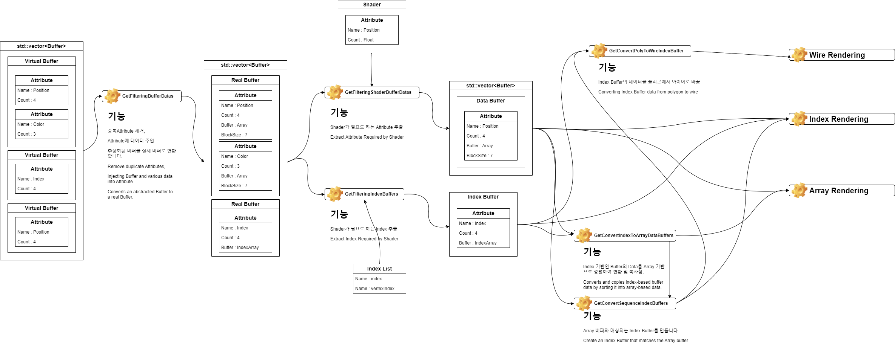
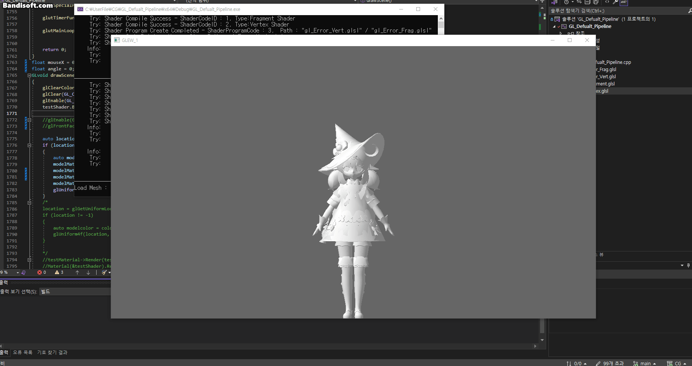
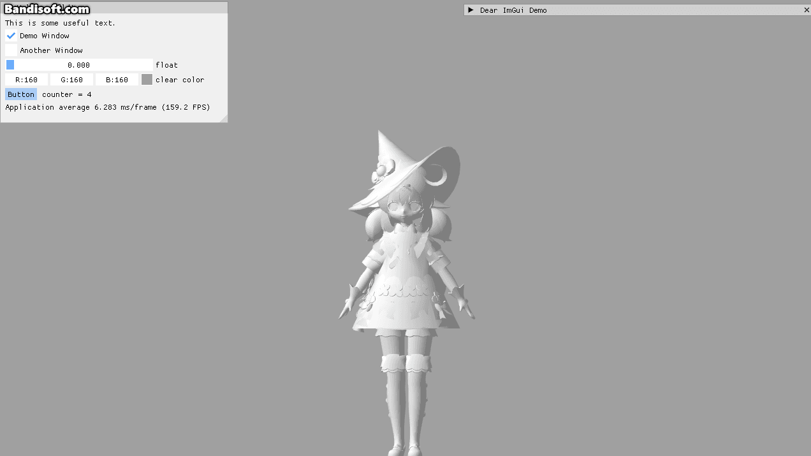
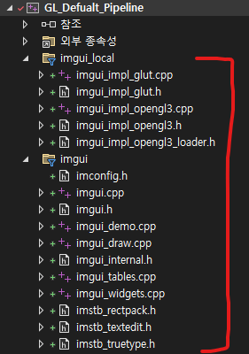
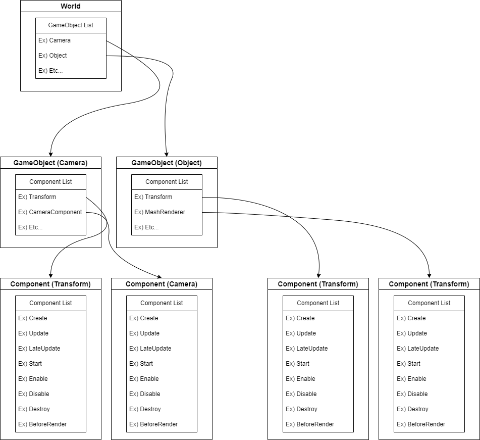

# OpenGL Rendering Pipeline

### 3rd Party
 - **GLEW, GLUT, GLM**
 - **Assimp**
 - **ImGui**

2023 University(한국공학대학교) Graphic APU (2.2 Grade) OpenGL Pipeline Process Develop Project
* * *
# DevLog
## <div align="center"> DevLog_1</div>
### - Buffer Converter 제작 -


## <div align="center"> DevLog_2 
### - Assimp inatall & Develop FBX Loader -

<div align="center"> (Example : Gensine Impect - Klee) </div>

## <div align="center"> DevLog_3 
### - IMGUI inatall & Game Logic & Frame System -

</br></br>
#### 프로젝트에 추가한 모습
Added to the project.  


</br></br>

#### 로직 시스템 계층 구조

</br></br>

#### 라이프사이클
```c++
void World::WorldUpdate()
{
    for (int i = 0; i < gameObjectList.size(); i++)
        gameObjectList[i]->Enable();
    for (int i = 0; i < gameObjectList.size(); i++)
        gameObjectList[i]->Start();
    for (int i = 0; i < gameObjectList.size(); i++)
        gameObjectList[i]->Update();
    for (int i = 0; i < gameObjectList.size(); i++)
        gameObjectList[i]->LateUpdate();
    for (int i = 0; i < gameObjectList.size(); i++)
        gameObjectList[i]->Disable();
    for (int i = 0; i < gameObjectList.size(); i++)
        gameObjectList[i]->PostBehavior();
    for (int i = 0; i < gameObjectList.size(); i++)
        if (gameObjectList[i]->destroy)
            gameObjectList.erase(gameObjectList.begin() + (i--));
}
void World::WorldRender()
{
    for (int i = 0; i < gameObjectList.size(); i++)
        gameObjectList[i]->BeforeRender();
}
```
</br></br>